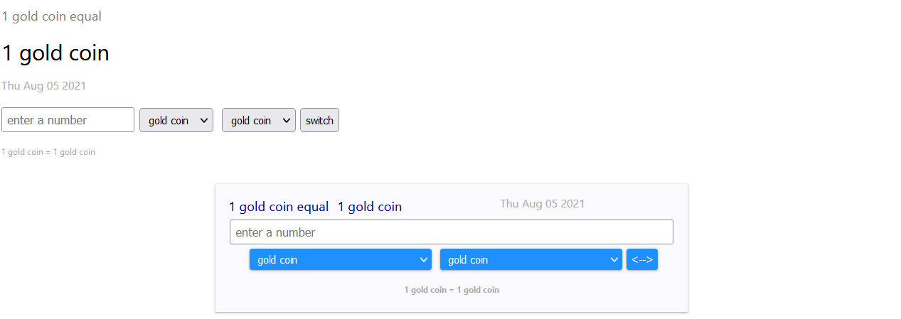

# currency_converter

> currency converter, candidate exercise

[](https://www.npmjs.com/package/currency_converter) [](https://standardjs.com)

## Install

```bash
npm install --save currency_converter
```

## Screenshot



## Usage
The component accept the following props:
- ```curriencies```: an object with two keys: ```primary``` and ```list```. primary refers to the key of primary currency in the list; and list contains a myraid of currencies/goods, represented by key-object with properties including ```name``` and ```value```
- ```customClassess```: an object that allows adding custom classes and styling to the html tag with the following keys ``` body, inputText, outputText, clock, input, options, button, formula ``` 
- ```texts ```: an object that contains texts, allowing localization. Changes including ``` placeholder, equals, switch, timeformat ```
- ```decimal```: rounding decimal


```jsx
import React from 'react'

import { CurrencyConverter } from 'currency_converter'
import 'currency_converter/dist/index.css'
import './App.css';


const example1 = {
  primary: "gold",
  list: {
    gold: {value: 1, name: "gold coin" },
    platinum: { value: 1.4 },
    silver: { value: 70 },
    diamond: { value: 0.3 },
  }
}


const classes = {
  body: "currencyBody",
  inputText: "textInput",
  outputText: "textOutput",
  clock: "currencyBodyClock",
  input: "",
  options: "",
  button: "",
  formula: "currentBodyFormula",
}


const cantoneseCurrencies = {
  primary: "gold",
  list: {
    gold: {value: 1, name: "黃金" },
    platinum: { value: 1.4, name: "白金" },
    silver: { value: 70, name:"白銀" },
    diamond: { value: 0.3, name: "鑽石" },
  }
}

const cantoneseText = {
  placeholder: "請輸入一個數字",
  equals: "等於",
  switch: "交換",
  timeformat: "YYYY年MM月DD日, HH:mm:ss a",
}


const App = () => {
  return  ( <div>
    < CurrencyConverter  decimal={7} />
    < CurrencyConverter  currencies={example1}  />
    < CurrencyConverter  currencies={example1} customClasses={classes} texts={{switch: "<-->"}} />
    < CurrencyConverter  currencies={cantoneseCurrencies} customClasses={classes} texts={cantoneseText} />
  </div>);
}

export default App
```

## License

MIT © [oscarngncc](https://github.com/oscarngncc)
